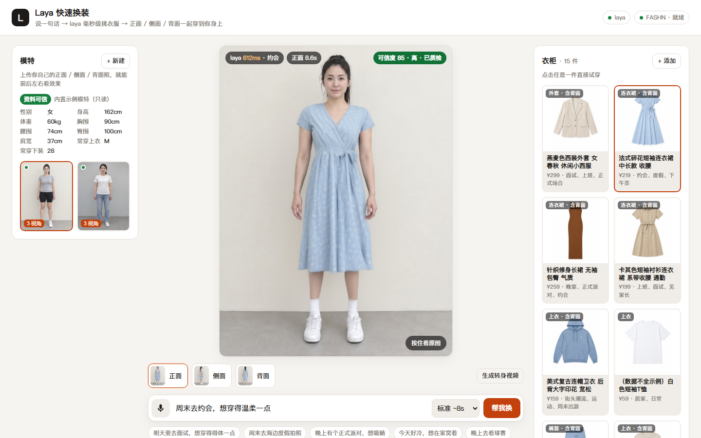

# Laya TryOn

[English](README.md) | 简体中文

> 说一句话挑衣服，正面 / 侧面 / 背面一起穿到你身上，并告诉你这张图有多可信。

Laya TryOn 是一个本地部署的**真人虚拟试衣**网站：

- **说需求挑衣服**：用 [laya](https://github.com/NandhaKishorM/laya) 决策模型在 0.2–0.4 秒内从衣柜里挑出最合适的一件（CPU 即可）。
- **多视角真人换装**：基于 [FASHN VTON v1.5](https://github.com/fashn-AI/fashn-vton-1.5)，上传自己的正 / 侧 / 背三视图，每个视角都换上身；0.8 秒出首帧预览，RTX 4060 上每个视角约 8 秒。
- **按尺码表模拟衣长**：根据你的身高、围度和商品尺码表挑尺码、算出下摆应该落在哪里，衣服该多长就多长，下摆以下保留你真实的腿。
- **真实性优先**：只重画衣服，不重画你的身体；照片和身材数据上传时就做校验，离谱的数据标为不可信。
- **可信度评分 + 结果质检**：每张图给出 0–100 分和逐条扣分原因；生成后自动量衣长和腿形，和尺码表或原照片对不上的图会被标成"质检未通过"。
- **可接入自己的生成模型（可选）**：配置任意 OpenAI 兼容的图片模型来生成模拟商品和模拟模特，或者写一个插件接入视频模型生成转身视频。



## 快速开始

需要：**Python 3.10+**、**NVIDIA 显卡（8GB 显存以上）**、约 **15GB 磁盘**（依赖 + 模型）。没有显卡也能装，但换一张图要几分钟。

```bash
git clone <this repo> laya-tryon && cd laya-tryon

# 1. 一键安装：两个隔离的虚拟环境、GPU 版 torch、FASHN 模型权重、laya 模型，最后自检
python scripts/setup.py                # 国内网络加 --hf-mirror

# 2. 启动（后台运行，就绪后自动打开浏览器）
python scripts/run.py start            # 停止：python scripts/run.py stop
```

打开 <http://127.0.0.1:7860>，左侧选一个内置示例模特，右侧点一件衣服，或者在输入框里说"明天要去面试"。

Windows 也可以用 `scripts\setup.ps1` / `scripts\start.ps1`，Linux / macOS 用 `scripts/setup.sh` / `scripts/start.sh`。安装有问题先运行 `python scripts/doctor.py`，再看 [故障排查](docs/zh-CN/troubleshooting.md)。

## 文档

| 文档 | 内容 |
|---|---|
| [部署指南](docs/zh-CN/deployment.md) | 硬件要求、安装选项、局域网访问、Linux 服务器 / 云 GPU 部署、升级与卸载 |
| [架构说明](docs/zh-CN/architecture.md) | 组件、请求流程、换装管线（遮挡策略、按尺码表定长、质检）、性能数据、关键技术选型 |
| [数据模型](docs/zh-CN/data-model.md) | 商品（电商字段）和人物模型、字段来源标注、如何接入真实电商数据 |
| [校验与评分](docs/zh-CN/validation-and-scoring.md) | 照片检查、身材数据可信度、尺码选择、可信度评分和结果质检规则 |
| [生成模型配置](docs/zh-CN/generation.md) | 接入自己的图片 / 视频模型，生成模拟商品、模拟模特、转身视频 |
| [API](docs/zh-CN/api.md) | 所有 HTTP 接口 |
| [开发指南](docs/zh-CN/development.md) | 目录结构、测试、模拟商品工具、如何扩展 |
| [故障排查](docs/zh-CN/troubleshooting.md) | 常见问题 |

## 项目结构

```
app/                后端（FastAPI）
  server.py         HTTP 接口
  tryon.py          FASHN VTON 推理、遮挡区域构建、结果质检
  fitting.py        尺码选择与衣长计划
  validation.py     照片检查与身材数据可信度
  scoring.py        可信度评分
  providers.py      生成模型接口（图片 / 视频，由用户配置）
  models.py         商品 / 人物数据模型
  config.py         配置（环境变量 / .env）
web/                前端（原生 HTML/CSS/JS，无构建步骤）
catalog/            模拟电商商品（listing.json + 平铺图）
samples/persons/    内置示例模特（AI 生成的虚拟人物，三视图 + 身材资料）
scripts/            setup.py 安装 / run.py 启停 / doctor.py 自检
tools/              生成模拟商品、模拟模特（需要配置图片模型）
plugins/            放你自己的生成模型实现（不入库）
tests/              单元测试、API 测试（无需 GPU）、浏览器端到端测试
docs/               文档
```

运行时生成、不入库的目录：`.venvs/`（虚拟环境）、`models/`（模型权重）、`data/`（上传的人物、换装结果、日志）。

## 已知局限

换装图由生成模型绘制，**不等于**真实试穿。本项目会尽量把"哪里是真实的、哪里是推测的"告诉用户，但请注意：

- 换装图体现衣长，但**不模拟围度松紧**：S 码和 XL 码穿上去看起来一样合身。
- 原照片里被衣服遮住的身体部位（例如长裤下的小腿），换成短裙时只能由模型推测。建议用户穿贴身短袖 + 短裤拍照，上传时会提示。
- 没有背面图的商品不会生成背面效果。
- 部分款式（尤其纯色短袖 T 恤）模型会画成短款，质检会检测到并标记为不可信。

详见 [校验与评分](docs/zh-CN/validation-and-scoring.md) 和 [架构说明](docs/zh-CN/architecture.md)。

## 许可证

本项目代码以 [Apache License 2.0](LICENSE) 发布。依赖的模型和第三方项目各有其许可证，在安装时下载、不随本仓库分发，详见 [NOTICE](NOTICE)。内置的示例模特和商品图均为 AI 生成，商品数据为虚构的模拟数据。
