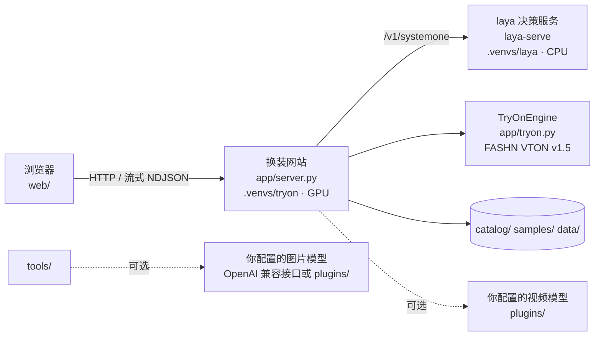
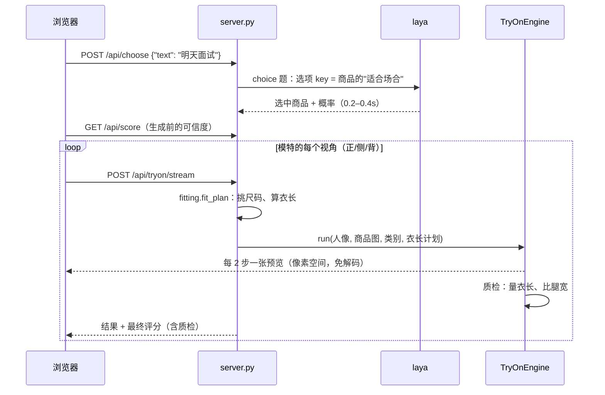

# 架构说明

## 组件

| 组件 | 进程 / 环境 | 作用 |
|---|---|---|
| 换装网站 | `uvicorn server:app`，`.venvs/tryon` | HTTP 接口、静态页面、换装推理（GPU）、校验和评分 |
| laya 决策服务 | `laya-serve`，`.venvs/laya` | 把"说的需求"映射成衣柜里的一件衣服，CPU 上约 0.2–0.4 秒（随衣柜大小增加） |
| 前端 | `web/`，原生 JS | 选模特、说需求、多视角查看、评分展示，不需要构建步骤 |

两个服务放在两个虚拟环境里，是因为 laya 需要 torch ≥ 2.14 和 transformers 5，FASHN 这边验证过的组合是 torch 2.6，两者不兼容。

## 一次换装的流程

## 换装管线（app/tryon.py）

### 1. 预处理（每张人像只做一次，结果缓存）

- DWPose 姿态检测，用来生成姿态图，作为模型的条件输入。
- FASHN 人体解析：区分脸、头发、上衣、裤子、手臂、腿等。
- 上传人像、选中模特时就在后台预处理，用户点衣服时直接复用缓存。

### 2. 构建"可重画区域"（build_agnostic）

这是保证真实性的核心。经过多轮对比实验，最后定下的规则是：

| 区域 | 处理 | 原因 |
|---|---|---|
| 旧衣服（按新衣服的类别） | 遮住，允许重画 | 必须脱掉 |
| 按尺码表算出的"新衣服占位带"（肩或腰到下摆） | 遮住 | 让衣服按真实长度画，而不是被旧衣服的轮廓截断 |
| 手臂 | 只有长袖才遮 | 否则垂在身侧的手臂会被画上袖套 |
| 腿（占位带以外） | **不遮** | FASHN 默认会把整条腿遮掉重画，实测腿会被画细约 30% |
| 脸、头发、手、脚 | 永远不遮 | 保证是本人 |

占位带的算法：用人体解析得到站立时的像素身高，结合用户填写的身高换算出每厘米对应的像素数。上衣和连衣裙从肩线（身高的 82% 处）起算，下装从腰线（身高的 62% 处）起算，加上尺码表里的衣长就得到下摆位置。没有尺码表或身高时不画占位带，衣服只能在旧衣服的轮廓内生成，评分会相应扣分。

### 3. 采样

- FASHN VTON v1.5 是像素空间的 MMDiT，使用 rectified flow 的 Euler 采样。
- 标准档 10 步。不启用 CFG 时只跑一遍条件分支（原版代码每一步都会同时算条件和无条件两个分支），计算量减半：4060 上从 16.5 秒降到约 8 秒。
- 模型直接在像素空间生成，每一步的预测结果 `x + (1 - t) * v` 本身就是一张图，不需要额外解码就能推给前端做预览。

### 4. 结果质检（quality_check）

对生成结果再做一次人体解析，然后：

- 找到新衣服的最低行，和占位带算出的下摆比较，换算成厘米偏差；
- 在下摆以下、鞋子以上的区域，比较原照片和结果里腿的宽度。

质检结果会进入评分（见 [校验与评分](validation-and-scoring.md)）。

## 性能（RTX 4060 8GB，每个视角）

| 档位 | 步数 | 引导 | 耗时 |
|---|---|---|---|
| 极速 | 6 | 无 | ~5s |
| 标准 | 10 | 无 | ~8s |
| 精细 | 20 | CFG 1.5 | ~30s |

首帧预览约 0.8 秒；三个视角串行生成，约 24 秒全部完成，正面最先出结果。laya 决策约 0.2–0.4 秒（15 件商品时约 0.35 秒）。

## 关键技术选型与实验记录

| 问题 | 结论 | 依据 |
|---|---|---|
| laya 在这个场景怎么用 | 选项的 **key 必须写成场合短语**（例如"面试、上班"），value 写商品名 | laya 0.3.7 上 8 句测试：key 用商品 id 只对 3 句，key 用场合对 8 句；升级到 0.3.20 后在 15 件商品上 8 句对 7 句 |
| 为什么不用 CatVTON | 它会重画整片区域，把身材往"模特"方向瘦身；在它外面打补丁会产生断臂、重影 | 实测多组对比 |
| 为什么选 FASHN VTON v1.5 | 看得到真实身体、保身形、文字和纹理还原好；Apache-2.0 | 4 个模特 × 5 件衣服对比 |
| 为什么不整片遮住下半身 | 腿会被画细约 30% | 同一组输入测腿宽比例：0.70（遮腿）vs 1.00（不遮） |
| 为什么需要按尺码表定长 | 不遮旧衣服时，新衣服会被截在旧衣服的长度；遮住又会瘦腿 | 中长裙被画成及膝，连衣裙被画成短裙 |
| 纯色短袖 T 恤偏短 | 属于模型对某些款式的偏好，不是遮挡方式或商品图比例造成的 | 把商品图拉长 1.3 倍后仍然偏短；真实商品图的 T 恤正常 → 改为靠质检发现并标记 |
