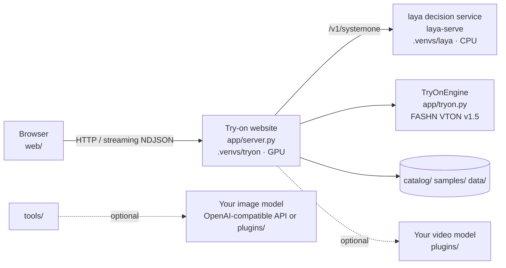
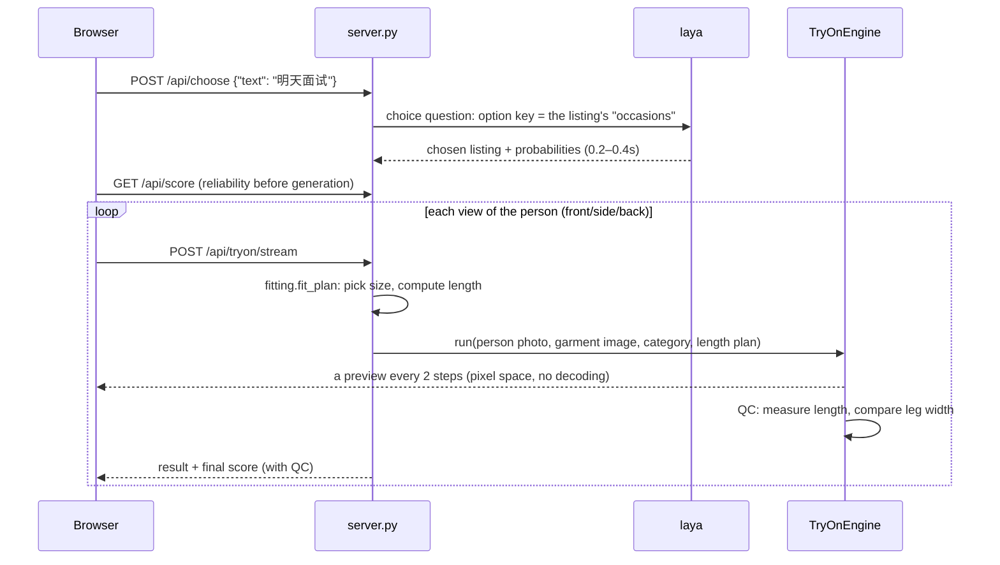

# Architecture

## Components

| Component | Process / environment | Role |
|---|---|---|
| Try-on website | `uvicorn server:app`, `.venvs/tryon` | HTTP API, static pages, try-on inference (GPU), validation and scoring |
| laya decision service | `laya-serve`, `.venvs/laya` | Maps a spoken request to one garment in the wardrobe, about 0.2–0.4 s on CPU (grows with wardrobe size) |
| Frontend | `web/`, plain JS | Pick a person, state a request, multi-view display, score display; no build step |

The two services live in two virtual environments because laya needs torch ≥ 2.14 and transformers 5, while the combination verified for FASHN is torch 2.6; the two are incompatible.

## Flow of one try-on

## Try-on pipeline (app/tryon.py)

### 1. Preprocessing (once per person photo, cached)

- DWPose pose detection, used to draw the pose map that conditions the model.
- FASHN human parsing: separates face, hair, top, trousers, arms, legs and so on.
- Preprocessing runs in the background when a person is uploaded or selected, so clicking a garment reuses the cache.

### 2. Building the repaintable region (build_agnostic)

This is the core of keeping results truthful. After several rounds of comparison experiments, the rules are:

| Region | Handling | Reason |
|---|---|---|
| Old clothes (by the new garment's category) | Masked, may be repainted | They have to come off |
| The new garment's band computed from the size chart (shoulder or waist down to the hem) | Masked | The garment is drawn at its real length instead of being cut off by the old clothes' outline |
| Arms | Masked only for long sleeves | Otherwise arms hanging beside the body get sleeves painted on |
| Legs (outside the band) | **Not masked** | FASHN masks and repaints whole legs by default, which measurably made legs about 30% thinner |
| Face, hair, hands, feet | Never masked | It must stay the same person |

How the band is computed: human parsing gives the standing height in pixels; with the height the user entered this yields pixels per centimetre. Tops and dresses start at the shoulder line (82% of body height), bottoms at the waistline (62% of body height); adding the size chart's garment length gives the hem position. Without a size chart or height no band is drawn, the garment can only be generated inside the old clothes' outline, and the score is reduced accordingly.

### 3. Sampling

- FASHN VTON v1.5 is a pixel-space MMDiT sampled with rectified-flow Euler steps.
- Standard mode uses 10 steps. Without CFG only the conditional branch is run (the original code computes both the conditional and unconditional branch at every step), halving the compute: on a 4060 from 16.5 s down to about 8 s.
- Because the model works in pixel space, each step's prediction `x + (1 - t) * v` is already an image and can be pushed to the frontend as a preview without any decoding.

### 4. Result quality check (quality_check)

The generated image is parsed again, then:

- the lowest row of the new garment is compared with the hem computed from the band and converted to a deviation in cm;
- in the area below the hem and above the shoes, leg width is compared between the original photo and the result.

The QC results feed into the score (see [Validation and scoring](validation-and-scoring.md)).

## Performance (RTX 4060 8GB, per view)

| Mode | Steps | Guidance | Time |
|---|---|---|---|
| Turbo | 6 | none | ~5s |
| Standard | 10 | none | ~8s |
| Quality | 20 | CFG 1.5 | ~30s |

The first preview arrives after about 0.8 s; the three views are generated one after another, all done in about 24 s, front first. A laya decision takes about 0.2–0.4 s (about 0.35 s with 15 listings).

## Key technical choices and experiment log

| Question | Conclusion | Evidence |
|---|---|---|
| How to use laya here | Option **keys must be occasion phrases** (e.g. "面试、上班" – interview, work), values are the product names | 8 test sentences on laya 0.3.7: product ids as keys got 3 right, occasions as keys got 8; after upgrading to 0.3.20, 7 of 8 right with 15 listings |
| Why not CatVTON | It repaints the whole region and slims the body toward a "model" figure; patching around it produced broken arms and ghosting | Several comparison runs |
| Why FASHN VTON v1.5 | Sees the real body, keeps body shape, reproduces text and texture well; Apache-2.0 | 4 people × 5 garments comparison |
| Why not mask the whole lower body | Legs get drawn about 30% thinner | Leg-width ratio on the same inputs: 0.70 (legs masked) vs 1.00 (not masked) |
| Why size the band from the size chart | Without masking the old clothes, the new garment is cut off at their length; masking them thins the legs | A midi skirt came out knee-length, a dress came out as a mini dress |
| Plain short-sleeve T-shirts come out short | A model preference for certain styles, not caused by the masking or the product image's proportions | Still short after stretching the product image by 1.3×; a real product photo of a T-shirt comes out normal → flagged by QC instead |
